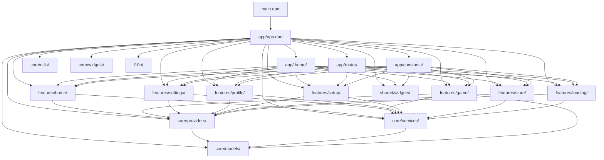

# TicTacToe XO Royale - Project Structure

## Project Overview

**TicTacToe XO Royale** is a premium Flutter mobile game that reimagines the classic Tic-Tac-Toe with modern UI/UX and Material 3 design principles. Built with a clean architecture approach, the project follows feature-based organization with clear separation of concerns.

### Key Characteristics
- **Architecture**: Feature-based clean architecture with Riverpod state management
- **UI Framework**: Flutter with Material 3 design system
- **State Management**: Riverpod for reactive state management
- **Navigation**: GoRouter for declarative routing
- **Code Generation**: Freezed for immutable models, Riverpod for providers
- **Testing**: Comprehensive test coverage for all major components

## Lib Directory Structure

```
lib/
├── main.dart                          # Application entry point
├── app/                               # Application-level configuration
│   ├── app.dart                      # Main app widget and configuration
│   ├── constants/                     # App-wide constants and configurations
│   │   ├── app_constants.dart        # Core application constants
│   │   └── dimensions.dart           # UI dimensions and spacing
│   ├── router/                        # Routing configuration and navigation
│   │   ├── app_router.dart           # Main router configuration
│   │   ├── routes.dart               # Route definitions
│   │   ├── navigation_service.dart   # Navigation service implementation
│   │   ├── navigation_helper.dart    # Navigation helper utilities
│   │   ├── route_transitions.dart    # Custom route transitions
│   │   ├── deep_linking.dart         # Deep linking functionality
│   │   ├── advanced_router.dart      # Advanced routing features
│   │   ├── router_config.dart        # Router configuration
│   │   ├── router_index.dart         # Router index
│   │   └── README.md                 # Router documentation
│   └── theme/                         # Theme configuration and styling
│       ├── app_theme.dart            # Main theme configuration
│       ├── color_schemes.dart        # Color scheme definitions
│       ├── typography.dart           # Typography styles
│       ├── motion_constants.dart     # Animation constants
│       └── theme_extensions.dart     # Theme extension methods
├── core/                              # Core application infrastructure
│   ├── models/                        # Data models and entities
│   │   ├── models.dart               # Models barrel file
│   │   ├── game_config.dart          # Game configuration model
│   │   ├── game_state.dart           # Game state model
│   │   ├── player_profile.dart       # Player profile model
│   │   ├── store_item.dart           # Store item model
│   │   ├── mock_data.dart            # Mock data for development
│   │   ├── player_profile.g.dart     # Generated profile code
│   │   └── store_item.g.dart         # Generated store item code
│   ├── providers/                     # State management providers
│   │   ├── providers.dart            # Providers barrel file
│   │   ├── theme_provider.dart       # Theme state management
│   │   ├── settings_provider.dart    # Settings state management
│   │   ├── profile_provider.dart     # Profile state management
│   │   └── store_provider.dart       # Store state management
│   ├── services/                      # Business logic and external services
│   │   ├── services.dart             # Services barrel file
│   │   ├── game_logic.dart           # Core game logic service
│   │   ├── robot_logic.dart          # AI opponent logic
│   │   ├── audio_service.dart        # Audio playback service
│   │   ├── haptic_service.dart       # Haptic feedback service
│   │   └── performance_service.dart  # Performance monitoring
│   ├── utils/                         # Utility functions and helpers
│   │   ├── utils.dart                # Utils barrel file
│   │   ├── adaptive_padding.dart     # Responsive padding utilities
│   │   ├── dynamic_type_support.dart # Accessibility support
│   │   ├── performance_optimizer.dart # Performance optimization
│   │   ├── responsive_builder.dart   # Responsive UI utilities
│   │   └── verification_utils.dart   # Input verification utilities
│   └── widgets/                       # Reusable UI components
│       ├── comprehensive_verification_widget.dart # Input verification widget
│       └── performance_monitor.dart   # Performance monitoring widget
├── features/                          # Feature modules
│   ├── game/                          # Game logic and gameplay features
│   │   ├── game.dart                 # Game feature barrel file
│   │   ├── providers/                 # Game state providers
│   │   │   └── game_provider.dart    # Game state management
│   │   └── presentation/             # Game UI components
│   │       ├── screens/               # Game screens
│   │       │   └── game_screen.dart  # Main game screen
│   │       └── widgets/               # Game UI widgets
│   │           ├── control_bar.dart   # Game control bar
│   │           ├── turn_indicator.dart # Turn indicator
│   │           ├── game_hud.dart      # Game heads-up display
│   │           ├── overlays/          # Game overlays
│   │           │   ├── exit_overlay.dart      # Exit confirmation
│   │           │   ├── result_overlay.dart    # Game result display
│   │           │   └── settings_overlay.dart # In-game settings
│   │           └── game_board/        # Game board components
│   │               ├── tic_tac_toe_board.dart # Main game board
│   │               └── painters/       # Custom painters
│   │                   ├── board_painter.dart      # Board background
│   │                   ├── cell_painter.dart       # Individual cell
│   │                   ├── mark_painter.dart       # X/O marks
│   │                   ├── winning_line_painter.dart # Winning line
│   │                   └── effects/                # Visual effects
│   │                       ├── ambient_painter.dart    # Ambient effects
│   │                       ├── confetti_painter.dart   # Celebration effects
│   │                       └── hint_sparkle_painter.dart # Hint effects
│   ├── home/                          # Home screen and main navigation
│   │   ├── home.dart                 # Home feature barrel file
│   │   ├── providers/                 # Home state providers
│   │   │   └── home_provider.dart    # Home state management
│   │   └── presentation/             # Home UI components
│   │       ├── home_screen.dart      # Main home screen
│   │       └── widgets/               # Home UI widgets
│   │           ├── ambient_particles.dart    # Background particles
│   │           ├── game_mode_cards.dart      # Game mode selection
│   │           ├── quick_stats_ribbon.dart   # Quick statistics
│   │           └── typewriter_text.dart      # Animated text
│   ├── loading/                       # Loading states and splash screens
│   │   ├── loading.dart              # Loading feature barrel file
│   │   ├── providers/                 # Loading state providers
│   │   │   └── loading_provider.dart # Loading state management
│   │   └── presentation/             # Loading UI components
│   │       ├── loading_screen.dart   # Main loading screen
│   │       └── widgets/               # Loading UI widgets
│   │           ├── ambient_background.dart   # Background animation
│   │           ├── logo_animation.dart       # Logo animation
│   │           ├── progress_bar.dart         # Loading progress
│   │           └── tips_carousel.dart        # Loading tips
│   ├── profile/                       # User profile management
│   │   ├── profile.dart              # Profile feature barrel file
│   │   ├── profile_screen.dart       # Main profile screen
│   │   └── presentation/             # Profile UI components
│   │       └── widgets/               # Profile UI widgets
│   │           ├── achievements_grid.dart    # Achievements display
│   │           ├── history_list.dart         # Game history
│   │           ├── profile_header.dart       # Profile header
│   │           └── stats_section.dart        # Statistics display
│   ├── settings/                      # Application settings and preferences
│   │   ├── settings.dart             # Settings feature barrel file
│   │   └── presentation/             # Settings UI components
│   │       ├── settings_screen.dart  # Main settings screen
│   │       └── widgets/               # Settings UI widgets
│   │           ├── about_section.dart        # About information
│   │           ├── settings_section.dart     # Settings grouping
│   │           ├── theme_selector.dart       # Theme selection
│   │           └── toggle_setting.dart       # Toggle settings
│   ├── setup/                         # Game setup and configuration
│   │   ├── setup.dart                # Setup feature barrel file
│   │   ├── providers/                 # Setup state providers
│   │   │   ├── setup_provider.dart   # Setup state management
│   │   │   ├── setup_provider.g.dart # Generated setup provider
│   │   │   └── setup_provider.freezed.dart # Freezed setup provider
│   │   └── presentation/             # Setup UI components
│   │       ├── setup_screen.dart     # Main setup screen
│   │       └── widgets/               # Setup UI widgets
│   │           ├── board_carousel.dart       # Board selection
│   │           ├── board_preview.dart        # Board preview
│   │           ├── choice_chips.dart         # Choice selection
│   │           ├── custom_text_field.dart    # Custom input field
│   │           └── win_carousel.dart        # Win condition selection
│   └── store/                         # In-app store and monetization
│       ├── store.dart                 # Store feature barrel file
│       └── presentation/             # Store UI components
│           ├── store_screen.dart      # Main store screen
│           └── widgets/               # Store UI widgets
│               ├── gem_balance.dart           # Currency display
│               ├── store_grid.dart            # Store items grid
│               ├── store_item_preview.dart    # Item preview
│               ├── store_tabs.dart            # Store categories
│               └── watch_ad_button.dart       # Ad watching
├── shared/                            # Shared components and utilities
│   └── widgets/                       # Common UI widgets
│       └── overlays/                  # Shared overlay components
│           └── blur_overlay.dart      # Blur effect overlay
└── l10n/                              # Localization and internationalization
```

## File Relationship Diagram



## Architecture Patterns

### 1. Feature-Based Organization
Each feature is self-contained with its own:
- UI components
- Business logic
- State management
- Models and services

### 2. Clean Architecture Layers
- **Presentation Layer**: UI components and screens
- **Business Logic Layer**: Services and providers
- **Data Layer**: Models and data structures

### 3. Dependency Injection
- Riverpod providers for state management
- Service locator pattern for dependencies
- Clear separation of concerns

### 4. State Management
- **Riverpod**: Reactive state management
- **Providers**: Scoped state containers
- **Notifiers**: State change handlers

## Key Components

### Core Infrastructure
- **Models**: Immutable data structures using Freezed
- **Providers**: State management with Riverpod
- **Services**: Business logic and external integrations
- **Utils**: Helper functions and constants
- **Widgets**: Reusable UI components

### Feature Modules
- **Game**: Core gameplay mechanics and logic
- **Home**: Main navigation and dashboard
- **Settings**: User preferences and app configuration
- **Profile**: User account management
- **Setup**: Game initialization and configuration
- **Store**: In-app purchases and monetization
- **Loading**: Loading states and transitions

### Application Layer
- **Router**: Navigation configuration with GoRouter
- **Theme**: Material 3 design system implementation
- **Constants**: App-wide configuration values
- **Localization**: Multi-language support

## Development Workflow

1. **Feature Development**: Work within feature modules
2. **State Management**: Use Riverpod providers for state
3. **UI Components**: Leverage shared widgets and theme system
4. **Testing**: Comprehensive test coverage for all components
5. **Code Generation**: Use build_runner for model generation

## Technology Stack

- **Framework**: Flutter 3.9+
- **State Management**: Riverpod
- **Navigation**: GoRouter
- **Code Generation**: Freezed, Riverpod Generator
- **UI**: Material 3, Flutter Animate
- **Testing**: Flutter Test
- **Linting**: Flutter Lints, Custom Lint

This structure ensures maintainability, scalability, and clear separation of concerns while following Flutter best practices and modern architecture patterns.
